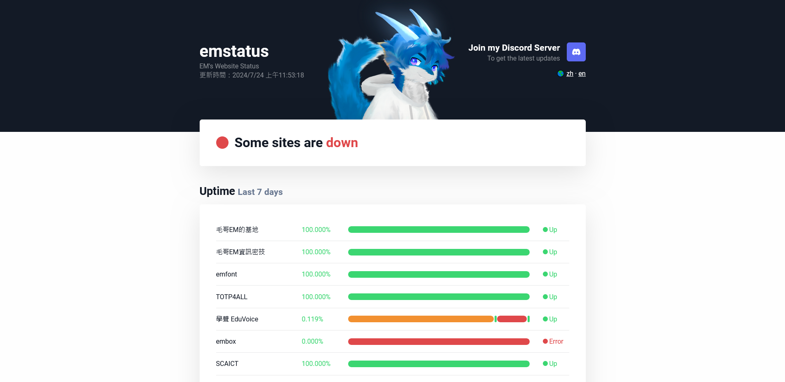
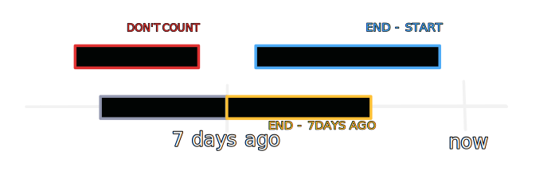

<!-- @format -->

# emstatus - EM's Website Status Monitor

[中文](README.md) | [English](README.en.md)

emstatus is a simple and efficient website status monitoring tool. It uses Google Apps Script to regularly check website status and updates results on GitHub.

<https://status.emtech.cc>

UI design inspired by [UptimeRobot](https://uptimerobot.com)

## Features

-   Automatically checks website status every 5 minutes
-   Displays website uptime chart for the past 7 days
-   Provides overall uptime statistics for 24 hours, 7 days, 30 days, and 90 days
-   Supports Chinese and English interfaces
-   Responsive design, adapts to various devices

## Tech Stack

-   Frontend: HTML, CSS, JavaScript
-   Backend: Google Apps Script
-   Data Storage: GitHub (JSON files)

### Uptime Calculation

The math was a bit confusing when I'm calculating uptime percentage, so here's a diagram to help understand.

## How to Use

1. Clone this repository
2. Paste the content of `Code.js` into Google Apps Script and set up automatic triggering to run the `checkWebsiteStatis` function
   
3. Modify your project URL in `index.html` and Google Apps Script
4. Generate and set up your GitHub Token, ensuring it has permission to read and write to your repository
5. Add the websites you want to monitor in the JSON file
6. Deploy the webpage to your web server. For example, this website uses GitHub Action to automatically deploy to GitHub Pages

## Contribution

Issues and pull requests are welcome. For major changes, please open an issue first to discuss what you would like to change.

## Contact

-   Author: [Elvis Mao](https://elvismao.com/index.en.html)
