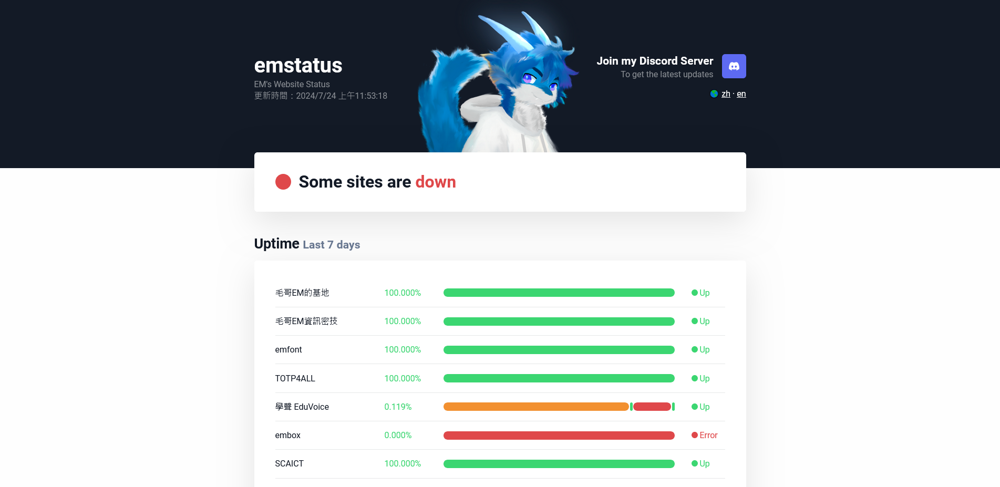
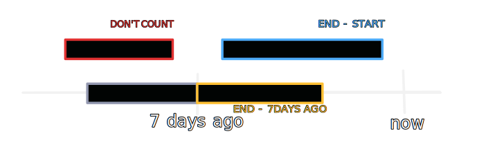
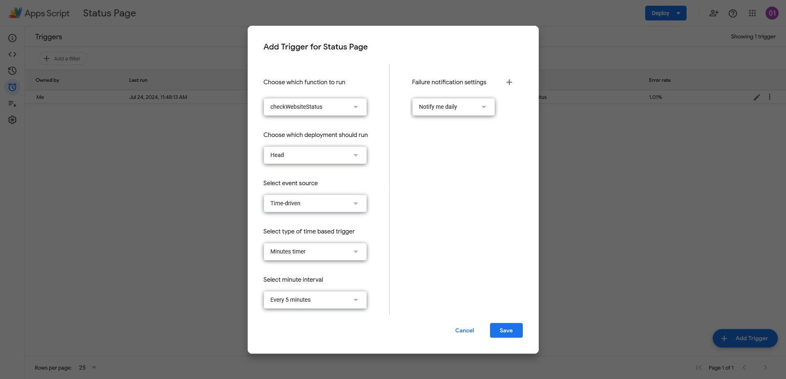

# emstatus - 毛哥EM的網頁狀態監控

> [!WARNING]  
> 此專案有一些爛問題無法正常顯示及紀錄，目前待修復，因此暫停執行。

[中文](README.md) | [English](README.en.md)

emstatus 是一個簡單而高效的網站狀態監控工具。它使用 Google Apps Script 定期檢查網站狀態，並在 GitHub 上更新結果。

<https://status.emtech.cc>

UI 設計靈感來自 [UptimeRobot](https://uptimerobot.com)

## 功能特點

- 每 5 分鐘自動檢查網站狀態
- 顯示近 7 天的網站運行狀況圖表
- 提供 24 小時、7 天、30 天和 90 天的整體運行時間統計
- 支持中文和英文界面
- 響應式設計，適配各種設備

## 技術棧

- 前端: HTML, CSS, JavaScript
- 後端: Google Apps Script
- 數據存儲: GitHub (JSON文件)

### 上線時間計算

做的時候數學有點亂，畫一下圖來幫助理解。

## 如何使用

1. 克隆此倉庫
2. 在 Google Apps Script 中貼上 `Code.js` 內容，並設定自動觸發執行 `checkWebsiteStatis` 函數

3. 於 `index.html` 以及 Google App Script 中修改你的專案網址。
4. 生成並設置您的 GitHub Token，確保他有權限讀寫您的存儲庫。
5. 在 JSON 文件中添加您想監控的網站。
6. 將網頁部署到您的網站服務器，以此網站為例，它使用 GitHub Action 自動部署到 GitHub Pages。

## 貢獻

歡迎提交問題和拉取請求。對於重大變更,請先開issue討論您想要改變的內容。

## 聯繫方式

- 作者: [毛哥EM](https://elvismao.com)
